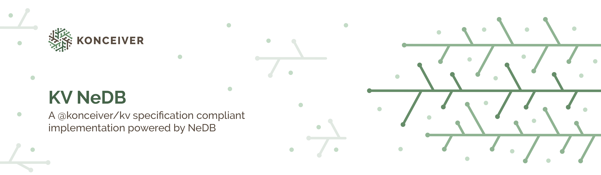

# @konceiver/kv-nedb

<p align="center"></p>

[](https://www.npmjs.com/package/@konceiver/kv-nedb)
[](./LICENSE)
[](https://img.shields.io/github/workflow/status/konceiver/kv-nedb/CI?label=CI)
[](https://npmjs.org/package/@konceiver/kv-nedb)

## Installation

```bash
yarn add @konceiver/kv-pouchdb
```

## Testing

```bash
yarn test
```

## Security

If you discover a security vulnerability within this package, please send an e-mail to security@konceiver.dev. All security vulnerabilities will be promptly addressed.

## Credits

- [Brian Faust](https://github.com/faustbrian)
- [All Contributors](../../../../contributors)

## License

[MIT](LICENSE) © [Brian Faust](https://basecode.sh)
